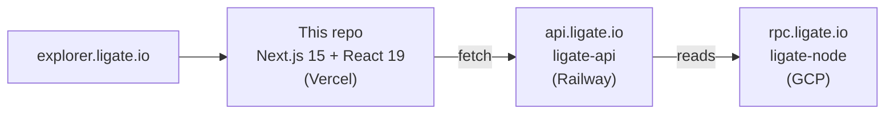

# ligate-explorer

[](https://github.com/ligate-io/ligate-explorer/actions/workflows/ci.yml) [](#license) [](https://github.com/ligate-io/ligate-chain) [](https://docs.ligate.io) [](#status)

Block explorer frontend for [Ligate Chain](https://github.com/ligate-io/ligate-chain). Blocks, transactions, schemas, attestor sets, and attestations: live state of devnet at [`explorer.ligate.io`](https://explorer.ligate.io).

## Quick start

You need [`pnpm`](https://pnpm.io) (Node 22+).

```bash
pnpm install
cp .env.example .env.local
pnpm dev          # http://localhost:3030
```

By default the dev server reads from typed mock fixtures (every route renders without a backend). Flip to a live backend by setting `USE_MOCK_API=false` and pointing `NEXT_PUBLIC_API_URL` at a running [`ligate-api`](https://github.com/ligate-io/ligate-api).

## Status

**Pre-devnet.** This repo is the Next.js frontend only — the Rust indexer + Postgres surface lives in [`ligate-io/ligate-api`](https://github.com/ligate-io/ligate-api). Tracking issue: [`ligate-chain#80`](https://github.com/ligate-io/ligate-chain/issues/80).

`ligate-devnet-1` is targeted for **Q2 2026**.

## What this is

Devnet without an explorer is a black hole for users. This frontend renders the public block-and-tx browser at `explorer.ligate.io`:

- Latest blocks + latest transactions on the homepage.
- Transaction detail view (sender, type, status, fee, signatures).
- Address detail (balance, recent tx history).
- Schema browser (name, version, attestor set, fees, recent attestations).
- One-click `$LGT` faucet for testing on devnet.
- Search bar that auto-routes by input shape (`lig1...`, `lsc1...`, 64-char hex).

UX inspiration: [Celenium](https://celenium.io/) (Celestia's block explorer). Differentiator is content (attestation primitives), not novel UX.

## Architecture



The frontend is a thin renderer over `api.ligate.io`. No direct chain RPC, no Postgres in this repo. All data fetching is centralised in `lib/api.ts` and runs in Server Components or Server Actions (faucet drip).

## Routes

| Route               | Purpose                                                                |
| ------------------- | ---------------------------------------------------------------------- |
| `/`                 | Dashboard: stats strip, block ticker, supply, 24h txs, attestation heatmap, sequencer set, fees, schemas + latest attestations, latest blocks + txs |
| `/blocks`           | All blocks list with stats strip + tx-density spark + pagination       |
| `/blocks/[height]`  | Block detail: identity (hash, prev, time), production (proposer, txs, fees), included transactions |
| `/txs`              | All txs list with type filter chips, success/reverted/pending counts, pagination |
| `/tx/[hash]`        | Tx detail: animated lifecycle SVG, header + execution grid, JSON payload viewer, events table |
| `/address/[addr]`   | Balance, tx count, first seen, role bond (sequencer / attester / prover), recent transactions |
| `/schemas`          | Schema registry list with name, id, version, owner, threshold, attestation count |
| `/schema/[id]`      | Schema detail: threshold ring, definition, fee routing & shape, recent attestations |
| `/faucet`           | One-button drip with circuit-trace backdrop, Server Action submit, success toast linking to tx |
| `/info`             | Chain identity, full chain hash, RPC + API endpoints, resource cards    |

Search bar in the header auto-routes by input shape: `lig1…` → `/address/[addr]`, `lsc1…` → `/schema/[id]`, 64-char hex → `/tx/[hash]`, digits → `/blocks/[height]`.

Out of scope for v0: `/attestor-sets/[id]`, charts beyond the homepage widgets, wallet integration, light mode, i18n.

## Layout

```
ligate-explorer/
├── app/              Next.js 15 App Router (10 routes)
│   ├── globals.css   Tailwind v4 + full brand token set + utility classes
│   ├── layout.tsx    MonoStrip + Header + main + Footer wrapper
│   ├── page.tsx      Homepage dashboard
│   ├── blocks/, tx/, txs/, schema/, schemas/, address/[addr]/
│   ├── faucet/       page.tsx + faucet-form.tsx + actions.ts (Server Action)
│   └── info/
├── components/       Shared UI
│   ├── shell:        header.tsx (search auto-routes), footer.tsx, mono-strip.tsx
│   ├── ui:           ui.tsx (FrameCard / Eyebrow / StatusPill / TypeTag / LV),
│   │                 copy-button.tsx, json-viewer.tsx
│   ├── svgs.tsx      NetworkOrb, TxFlow, ThresholdRing, BlockSpark, CircuitDrop, icons
│   ├── dashboard.tsx 7 home widgets (Supply, Tx24h, DailyAttestations, Sequencers, FeeTracker, StatsStrip, RunNodeStrip)
│   ├── block-ticker-card.tsx  Client widget with live ETA progress bar
│   ├── tables.tsx    BlocksTable + TxsTable (client; useRouter for click navigation)
│   └── pagination.tsx
├── lib/
│   ├── api.ts        Server-only API client (USE_MOCK_API toggle)
│   ├── api-types.ts  Wire types
│   ├── mock.ts       Typed fixtures (36 blocks, 60 txs, 5 schemas, addresses with roles)
│   └── format.ts     trunc, ago, fmtLgt, isoDate, shortHash
└── public/           Favicons (mirrors ligate.io) + site.webmanifest
```

## Environment

```bash
NEXT_PUBLIC_API_URL=https://api.ligate.io     # ligate-api root
NEXT_PUBLIC_RPC_URL=https://rpc.ligate.io     # chain RPC, read-only
USE_MOCK_API=true                             # set false to hit the real API
```

Set on Vercel for prod and in `.env.local` for dev. See [`.env.example`](.env.example) for the canonical list.

## Deploy

- **Vercel.** Root directory `/`, framework auto-detected as Next.js. Set the three env vars above. Push-to-deploy from `main`.
- **DNS.** `explorer.ligate.io` → Vercel project.

## Brand

Tokens mirror [`ligate-io/ligate-marketing`](https://github.com/ligate-io/ligate-marketing) — sage `#A7D28C` accent, obsidian `#0a0a0b` bg, bone `#EFEAD8` ink, Instrument Serif headings, Space Grotesk body, JetBrains Mono chrome. If a route doesn't feel brand-consistent, look at how `apps/landing/src/components/hero/Hero.tsx` does it and mirror the pattern.

## Related

- Tracking: [`ligate-chain#80`](https://github.com/ligate-io/ligate-chain/issues/80)
- Backend: [`ligate-io/ligate-api`](https://github.com/ligate-io/ligate-api)
- Chain: [`ligate-io/ligate-chain`](https://github.com/ligate-io/ligate-chain)
- TypeScript SDK: [`ligate-io/ligate-js`](https://github.com/ligate-io/ligate-js) (`@ligate/sdk` — address validators, etc.)

## License

Apache-2.0 OR MIT, at your option. See [`LICENSE-APACHE`](LICENSE-APACHE) and [`LICENSE-MIT`](LICENSE-MIT).
